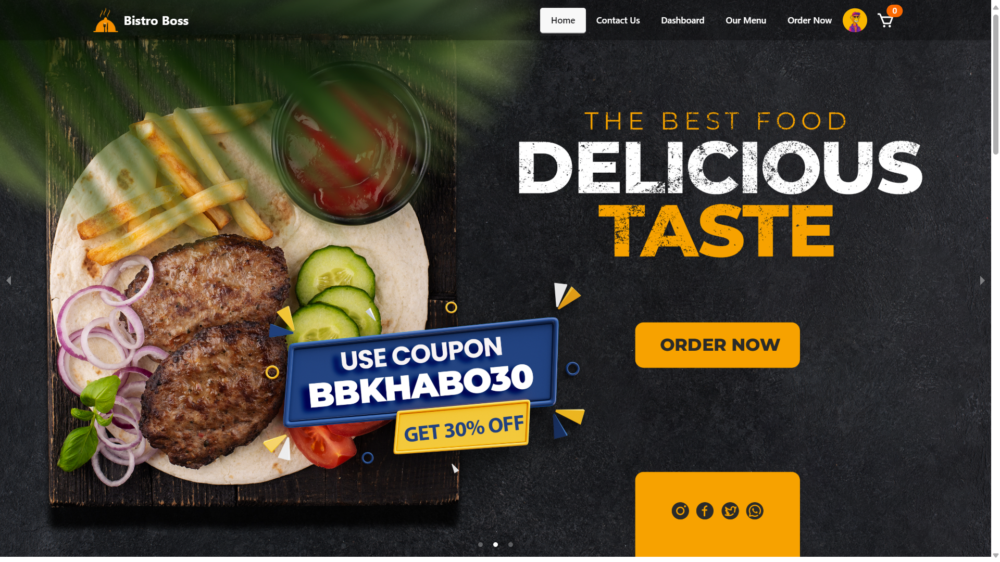
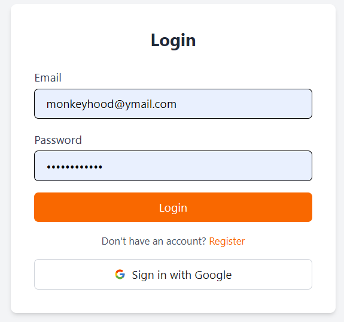
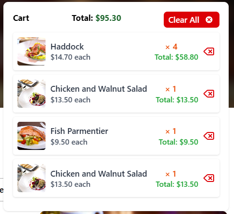

# 🍽️ Bistro Boss

Bistro Boss is a full-featured restaurant web application built with the MERN stack. It includes user authentication, dynamic menu management, a shopping cart, admin dashboard, and more. Perfect for a modern food ordering experience.

---

## 🚀 Live Demo

> Coming soon...

---

## ✨ Features

### 🛍️ User Features
- Browse dynamic food menu categorized by type
- Add items to cart
- Quantity-based grouping in cart
- Cart total calculation
- Responsive mobile-first design
- Smooth UI with Tailwind transitions

### 🛠️ Admin Dashboard
- Manage menu items (Add/Edit/Delete)
- View and manage all user carts
- Order management panel
- User management with role-based access

### 🔒 Authentication
- Login / Register with JWT
- Role-based protected routes
- Auto logout & error handling

---

## 💻 Tech Stack

| Frontend         | Backend            | Database       | Others             |
|------------------|--------------------|----------------|--------------------|
| React.js         | Node.js            | MongoDB        | Tailwind CSS       |
| React Router DOM | Express.js         | Mongoose       | DaisyUI            |
| Axios            | JWT Authentication |                | React Hook Form    |

---

## 📌 TODO

- [ ] Add Stripe payment integration
- [ ] Real-time order status updates (socket.io)
- [ ] Deploy frontend on Vercel
- [ ] Deploy backend on Render

---

## 🖼️ Screenshots

> 
> 
> 
> 
> 

---

## 🙌 Author

Made with 💙 by [Ashib Ullah](https://github.com/ashibullah)

---

## 📃 License

MIT © 2025 Bistro Boss
